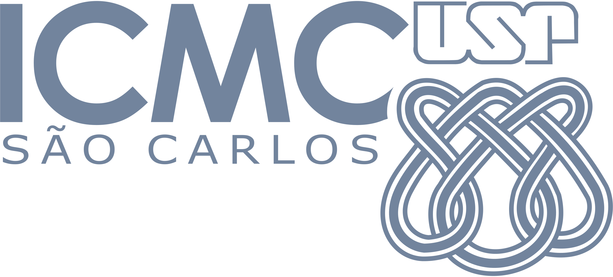

# Porttagger - Brazilian Portuguese Part-of-Speech Tagger

This repository contains the code necessary to reproduce results of my master's dissertation "Etiquetagem morfossintática multigênero para o português do Brasil segundo o modelo Universal Dependencies".

If just want to use the created tagger without downloading anything, you can play with it in a live [demo](https://huggingface.co/spaces/Emanuel/porttagger) available at Hugginface Spaces 🤗.

The main goal of this work is to create a robust multigenre part-of-speech tagger for Brazillian Portuguese.
In the `porttinari` folder can be found the training notebooks to reproduce the evaluation of seven tagging methods on the [Porttinari-base](https://sites.google.com/icmc.usp.br/poetisa/resources-and-tools) corpus.
You can find the artifacts of each experiment in [google drive](https://drive.google.com/drive/folders/138XUUAvLqE-cD3JiJRIQkl-cKPqeRj28?usp=sharing) for the CNCSR, Meta-Bilstm, Stanza, and UDPipe 2 models.
For the Transformer-based models, the results of the experiments are stored at [wandb](https://wandb.ai/huber-ai/pos_porttinari).

After experimentation and the selection of the BERTimbau-base model in the evaluation process in a single corpus, the multigenre evaluation was made in three corpora with distintict genres with similar annotation guidelines:

* [Porttinari-base](https://sites.google.com/icmc.usp.br/poetisa/resources-and-tools): A subset of the Porttinari treebank and contains 8,420 news sentences and 168,400 tokens.
* [DANTEStocks](https://sites.google.com/icmc.usp.br/poetisa/resources-and-tools): A total of 4,048 Brazilian stock market tweets and 81,048 tokens.
* [PetroGold](https://github.com/UniversalDependencies/UD_Portuguese-PetroGold): A total of 8,946 academic texts from the oil & gas domain and 250,905 tokens.

The notebook for reproducibility is the same one used in the Porttinari-base (single corpus) experiment, therefore, it can be located in the `porttinari/notebooks` dir.
The predictions and confusion matrices can be found at the `multigenre/outputs` folder.

For error analysis notebooks, they can be found in the `notebooks` folder.

This project was supported by Centro de Inteligência Artificial (C4AI-USP), Fundação de Apoio à Pesquisa do Estado de São Paulo (FAPESP), IBM Corporation, and Motorola through the Ministério da Ciência e Tecnologia (MCTI).

---

    

        
        
        
    

